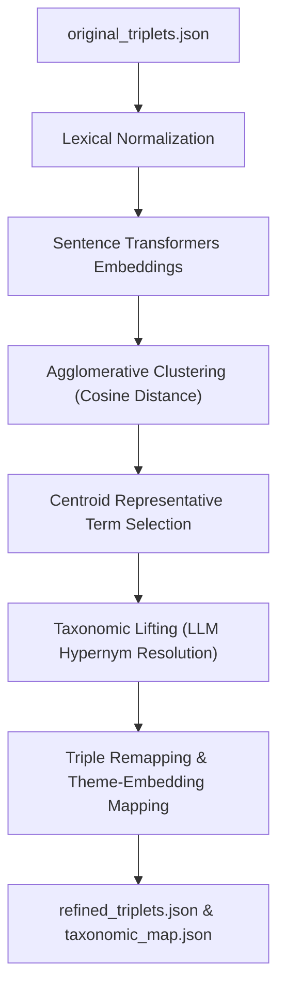
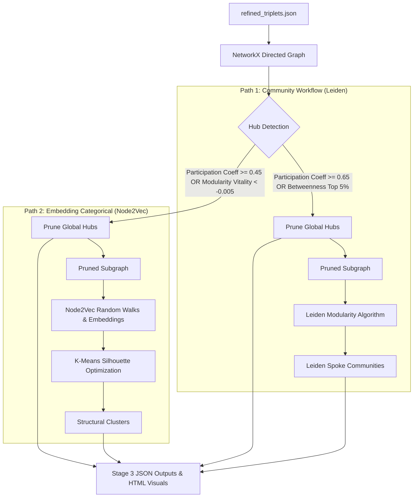
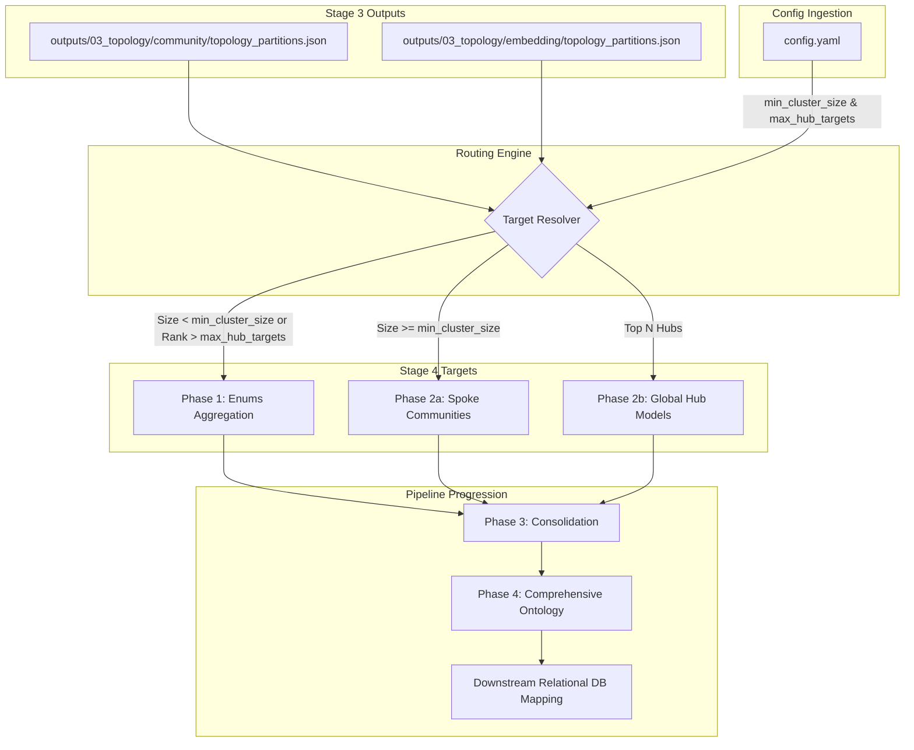
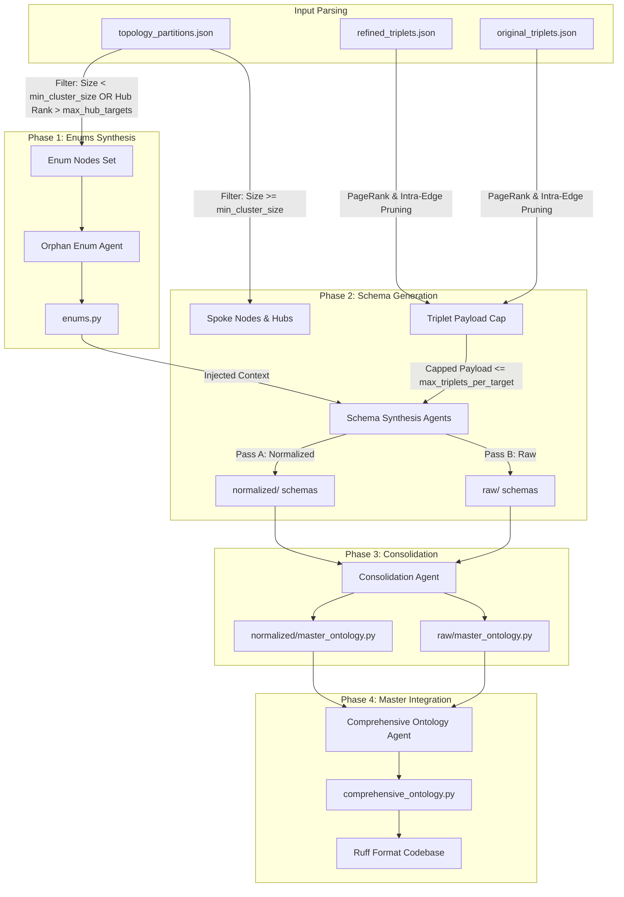

# SemanticPrism

SemanticPrism is an advanced, autonomous agentic pipeline designed to process unstructured, highly complex domain knowledge (such as clinical diagnostic texts) and mathematically synthesize it into structured, deployable Python Ontologies (Pydantic models).

The purpose of SemanticPrism is to solve the "hallucination and overlap" problem inherent in standard Large Language Model (LLM) schema generation. Rather than asking an LLM to guess the structure of a document in one shot, SemanticPrism breaks the text down into mathematical graph networks, clusters those networks using advanced graph theory and representation learning algorithms, and uses those mathematical boundaries to generate perfectly decoupled, high-fidelity data models.

---

## Overall Pipeline Execution Flow

The entire pipeline is orchestratable via the master script [run_pipeline.py](run_pipeline.py).
To run all stages in sequence, execute:
```bash
python3 run_pipeline.py
```
This execution uses separate subprocesses for each stage to ensure that GPU VRAM and system memory are cleanly garbage collected between intensive LLM and mathematical clustering processes.

---

## Detailed Pipeline Architecture & Stage Breakdowns

The pipeline runs sequentially across four stages, utilizing outputs from preceding runs.

### Stage 1: Extraction ([run_stage_1.py](run_stage_1.py))
**Purpose:** To ingest unstructured source texts and extract raw semantic relationships and global themes.

*   **Global Theme Discovery:** The pipeline scans the input documents in sliding text chunks to identify overarching "Master Themes" (e.g., *Symptomology*, *Interventions*, *Accommodations*).
    *   *Underlying Detail (Context Anchoring):* The extracted themes provide semantic boundaries for the LLM during triple extraction. By anchoring the LLM to predefined themes, it prevents "hallucinated drift" when parsing massive, dense documents.
*   **Triplet Extraction:** Employs Pydantic-AI agents to extract Subject-Predicate-Object (S-P-O) triplets alongside their associated theme.
    *   *Underlying Detail (Graph Construction Foundation):* This process translates dense, natural prose grammar into discrete entities (Subject, Object) and relationships (Predicate), transforming the text into nodes and directed edges for the graph representation in Stage 3.
*   **Output Files:** Saves individual run files under `outputs/01_extraction/` and aggregates them into:
    *   `all_themes.json`: Raw discovered themes.
    *   `master_themes.json`: Synthesized master domain and theme mappings.
    *   `original_triplets.json`: All raw extracted S-P-O triplets.

---

### Stage 2: Refinement ([run_stage_2.py](run_stage_2.py))
**Purpose:** To clean, deduplicate, and normalize the raw, noisy triplets into a standardized, clean taxonomy.



*   **Lexical Normalization:** Cleans text syntax (stripping underscores, lowercase formatting) and uses batch LLM agents to correct spelling mistakes, expand acronyms, and normalize phrasing.
    *   *Underlying Detail (Preventing Graph Fragmentation):* Ensures that variations such as *"WISC-5"*, *"wisc-v"*, and *"wisc 5"* map to the exact same string. Otherwise, they would form disjoint nodes, fracturing the graph topology.
*   **Sentence Embeddings:** Converts normalized terms into dense, high-dimensional vector representations using `SentenceTransformers` (defaulting to `all-MiniLM-L6-v2`).
    *   *Underlying Detail (Semantic Coordinate Mapping):* Embeddings translate text words into coordinates in a semantic vector space. The distance between points corresponds to semantic meaning; terms representing similar concepts (e.g., *"severe anxiety"* and *"extreme worry"*) are mapped close to one another in space.
*   **SVO Vector Clustering (Agglomerative Clustering):** Uses Scikit-learn's `AgglomerativeClustering` using average linkage and cosine distance.
    *   *Underlying Detail (Mathematical Deduplication):* Groups terms whose cosine distance is below the `clustering_threshold`. It calculates a centroid for each cluster using frequency-weighted vector averages. The term closest to the centroid vector is selected as the representative term.
*   **Taxonomic Lifting:** Passes cluster terms to an LLM to resolve them into a formal hypernym (parent concept).
    *   *Underlying Detail (Standardizing Vocabulary):* Translates synonym groups into formal class names (e.g., mapping *"wisc-v"*, *"wisc 5"*, and *"cognitive test"* to *"WISC psychometric assessment"*).
*   **Triple Remapping:** Re-maps the subjects, predicates, and objects of all raw triplets to their taxonomic hypernyms, outputting clean, normalized triplets.
*   **Theme-Based Embedding Mapping:** Groups lower-level themes under master themes by computing the cosine similarity between their respective sentence embeddings.
*   **Output Files (saved under `outputs/02_refinement/`):**
    *   `subject_normalization_map.json` / `predicate_normalization_map.json` / `object_normalization_map.json`
    *   `taxonomic_map.json`: Combined normalization and taxonomic map.
    *   `refined_triplets.json`: Fully cleaned and remapped triplets.
    *   `theme_mapping_clusters.json`: Hierarchical mappings of themes.

---

### Stage 3: Dual-Path Graph Topology ([run_stage_3.py](run_stage_3.py))
**Purpose:** To map refined triplets into a network graph and execute **Dual-Path Topological Partitioning** to discover workflow sequences and structural category taxonomies.



#### Detailed Stage 3 Process Flow & Updates
*   **Dual-Path Split:** The network graph is partitioned down two paths:
    1.  **Path 1 (Community Workflow Path):** Prunes cross-domain connector hubs (using a high Participation Coefficient $P_i \ge 0.65$ or top 5% shortest-path betweenness centrality) to isolate tight modular event-sequences. The remaining graph is partitioned using the **Leiden Modularity Algorithm**.
    2.  **Path 2 (Embedding Categorical Path):** Prunes nodes based on Modularity Vitality ($\Delta Q < -0.005$, indicating nodes whose removal increases modularity and structural separation). It then generates high-dimensional structural representations using **Node2Vec** random walks, which are clustered using **Silhouette K-Means Optimization**.
*   **Visualization Pruning (Visual Boundary Separation):**
    *   *Intra-Cluster Filtering Update:* In the hubs-only global network visualizer (`interactive_global_hubs.html`), edges connecting hubs of different clusters are pruned. Only intra-cluster edges are drawn. This visually isolates distinct functional sectors and prevents the visual display from cluttering with global transition lines.
*   **Output Location:** `outputs/03_topology/community/` and `outputs/03_topology/embedding/`
    *   `topology_partitions.json`: Contains the node assignments, global hubs, orphans, and centrality metrics (pagerank, degree centrality, betweenness).
*   **Visualizations:** Exports 10 interactive HTML dashboards (such as `interactive_topology_graph.html` and `interactive_collapsed_modules.html`) representing the network topology. Rendering options like `max_total_visual_nodes` (defaulting to `0.25` or top 25%) are used to ensure smooth canvas performance in the browser.

---

### Transition: Stage 3 to Stage 4 Data Flow

This diagram maps how raw partitions and metrics exported by Stage 3 are dynamically resolved and routed by the Stage 4 synthesis target controller:



---

### Stage 4: Synthesis Engine ([run_stage_4.py](run_stage_4.py))
**Purpose:** To translate mathematical graph partitions back into deployable Python Pydantic ontologies using path-isolated, multi-pass LLM synthesis.



#### Detailed Stage 4 Process Flow & Updates
*   **Relational Database-Driven Constraints:**
    System prompts have been re-engineered to produce schemas optimized for downstream relational SQL databases and extraction tools:
    1.  *No Unique Identifiers:* Agents are forbidden from generating arbitrary key fields (like `id` or `uuid`), delegating identifier injection to a deterministic offline pipeline.
    2.  *Strict Enums/Literals:* Forces the classification of type, state, status, category, and metadata properties using class definitions in `enums.py` or standard Python `Literal` strings.
    3.  *Default to Optional:* All attributes default to `Optional[Type] = None` to prevent downstream Pydantic AI extraction models from hallucinating value properties that are absent in clinical source texts.
    4.  *JSONB Table Collapsing:* Secondary or scalar attributes are grouped into a single metadata dictionary (e.g. `metadata: Optional[Dict[str, Any]] = None`) to map to SQL `JSONB` columns, keeping tables narrow and preventing database column bloat.
*   **Hub Centrality-Based Pruning (`max_hub_targets`):**
    On massive graphs, the number of global hubs can grow very large, leading to schema bloat.
    *   *Centrality Ranking:* The pipeline ranks global hubs based on their betweenness and degree centrality.
    *   *Capping & Routing:* Only the top $N$ hubs (controlled by `max_hub_targets` in `config.yaml`, defaulting to `10`) are generated as standalone schema tables. Remaining low-centrality hubs are routed directly to the Phase 1 `enums.py` aggregator, maintaining complete semantic standard coverage without inflating the database table footprint.
*   **PageRank Triplet Payload Pruning (`max_triplets_per_target`):**
    For dense graphs where communities contain thousands of relations, the payload size is capped (controlled by `max_triplets_per_target`, defaulting to `1000` triplets) to prevent token window overflow.
    *   *PageRank Sorting:* Triplets are ranked by the average PageRank of their subject and object nodes.
    *   *Intra-Edge Bonus:* Triplets linking two nodes within the target community are prioritized, ensuring that the core, high-density internal relationships are preserved for the LLM.
    *   *Perfect Cross-Pass Indexing:* The selected triplet indices are identically mapped between the normalized pass (Pass A) and the raw pass (Pass B), guaranteeing that the two generated master models align on the same semantic facts.
*   **Ollama/Local Model Compatibility Layer:**
    Modified model configuration settings in `synthesis_agents.py` to prevent `400 Bad Request` execution crashes on Ollama endpoints:
    *   *Exclude max_tokens:* Dynamically omits `max_tokens` from `ModelSettings` when `provider == 'ollama'`, avoiding the `max_completion_tokens` parameter which Ollama rejects.
    *   *Auto Tool Choice:* Sets `tool_choice="auto"` for Ollama runs, bypassing Ollama's rejection of forced `"required"` tool configurations.
*   **Detailed Log Diagnostics:**
    *   *Composition Summary:* Prints the target breakdown (`spokes` vs. `hubs`) at execution startup.
    *   *Size Metrics:* Prints the exact node size and triplet count for every target and pass.
    *   *Failure Dumps:* On output retry failures, it prints Pydantic validation location trace errors and dumps the raw LLM responses for all 3 retry attempts to facilitate quick prompt debugging.

---

## Configuration Parameter Guide (`config.yaml`)

The entire execution of SemanticPrism is parameterized through [config.yaml](config.yaml):

| Config Section | Parameter | Type | Default | Description & Selection Guidance |
| :--- | :--- | :--- | :--- | :--- |
| **`pipeline`** | `use_async` | `boolean` | `true` | When enabled, API calls to the LLM (in Stages 2 and 4) are fired concurrently. |
| **`pipeline`** | `resume_mode` | `string` | `"skip"` | `"skip"` resumes from existing on-disk stage outputs; `"overwrite"` clears previous runs. |
| **`directories`**| `inputs` | `string` | `"inputs/testdocs"` | Directory path containing raw text source documents (`.txt` or `.md`). |
| **`directories`**| `outputs` | `string` | `"outputs"` | Base directory path where all stage outputs, logs, and schemas are saved. |
| **`llm`** | `provider` | `string` | `"ollama"` | Model provider host (e.g., `"ollama"`, `"google"`, `"openai"`). |
| **`llm`** | `model_name` | `string` | `"gemma4:26b"` | Model identifier on provider host. |
| **`llm`** | `temperature` | `float` | `0.0` | Controls LLM creativity. Keep at `0.0` for maximum determinism. |
| **`llm`** | `manage_vram` | `boolean` | `true` | Purges system VRAM between stages to prevent Out-Of-Memory (OOM) GPU errors. |
| **`extraction`** | `domain` | `string` | `"General Subjects"`| Context domain setting given to Stage 1 extraction agents. |
| **`refinement`** | `clustering_threshold`| `float` | `0.6` | Agglomerative Clustering cosine distance cutoff for term deduplication. |
| **`topology`** | `execution_mode` | `string` | `"both"` | Stage 3 partition execution mode (`"community"`, `"embedding"`, or `"both"`). |
| **`topology`** | `community_path.participation_threshold` | `float` | `0.65` | Participation cutoff ($P_i$) for Path 1 cross-community hubs. |
| **`topology`** | `community_path.betweenness_percentile` | `float` | `0.95` | Betweenness percentile cutoff for Path 1 narrative chokepoints. |
| **`topology`** | `embedding_path.participation_threshold` | `float` | `0.45` | Participation cutoff ($P_i$) for Path 2 cross-category hubs. |
| **`topology`** | `embedding_path.enable_modularity_vitality_pruning` | `boolean` | `true` | Prunes boundary-blurring nodes ($\Delta Q < -0.005$) to isolate pure category clusters. |
| **`synthesis`** | `execution_mode` | `string` | `"community"` | Stage 4 topology ingestion mode (`"community"`, `"embedding"`, or `"both"`). |
| **`synthesis`** | `schema_pass_mode` | `string` | `"both"` | Stage 4 pass mode (`"normalized"`, `"raw"`, or `"both"`). |
| **`synthesis`** | `min_cluster_size` | `integer` | `5` | Entity threshold for Stage 4 target qualification ($<5$ routed to `enums.py`). |
| **`synthesis`** | `max_hub_targets` | `integer` | `10` | Caps the number of global hub schema targets; remaining hubs are routed to `enums.py`. |
| **`synthesis`** | `max_triplets_per_target` | `integer` | `1000` | Caps the number of triplet statements sent to the LLM per schema target. |
| **`synthesis`** | `context_window_cap`| `integer` | `16384` | Context window cap in tokens for schema generation and consolidation. |
