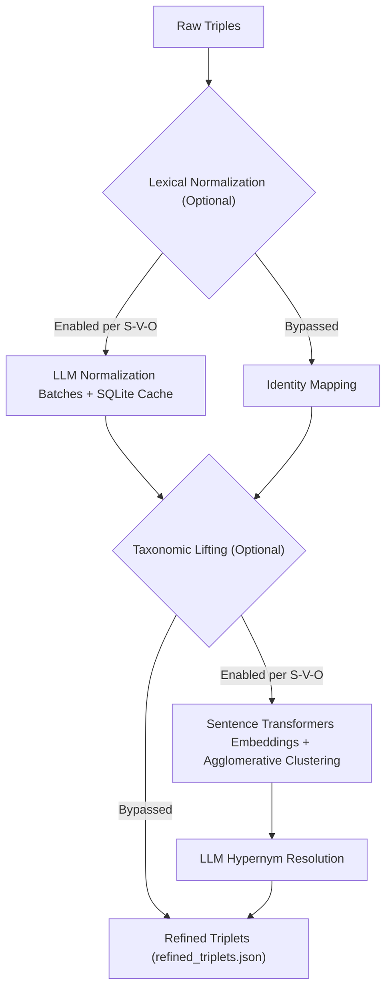
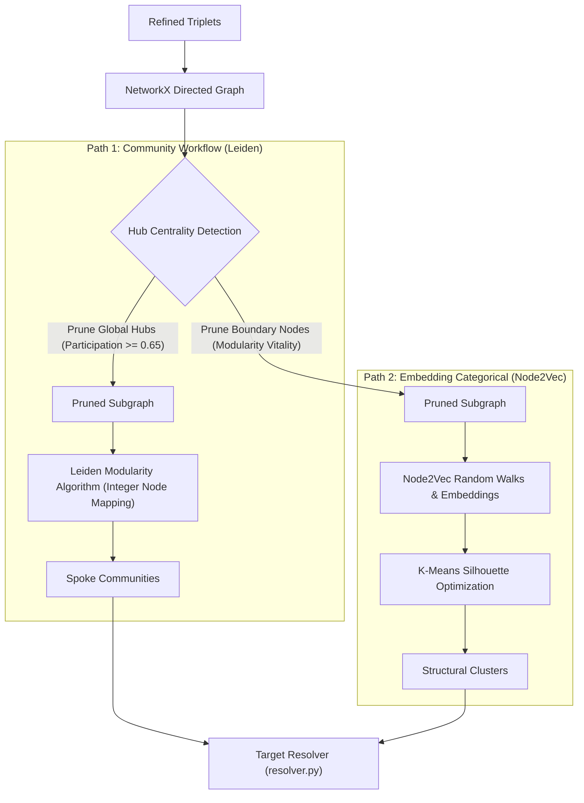
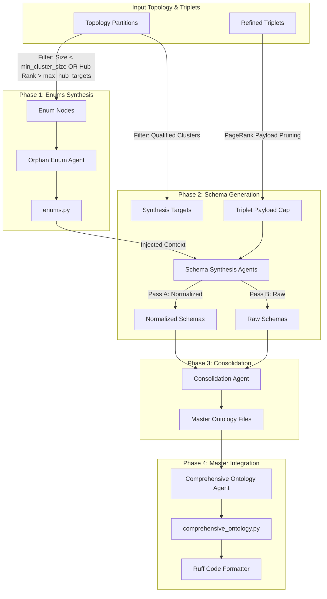

# SemanticPrism

SemanticPrism is an advanced, autonomous agentic pipeline designed to process unstructured, highly complex domain knowledge (such as clinical diagnostic texts) and mathematically synthesize it into structured, deployable Python Ontologies (Pydantic models).

Rather than relying on single-shot LLM schema generation—which often leads to hallucinations and overlapping domain definitions—SemanticPrism converts source text into mathematical graph networks, clusters those networks using graph theory and representation learning, and uses those structural boundaries to generate decoupled, high-fidelity data models.

---

## Prerequisites & Quickstart

### Prerequisites
- **Python**: 3.10 or higher
- **LLM Provider**: Local [Ollama](https://ollama.com/) instance (e.g., `qwen2.5:7b`) or API provider (OpenAI, Gemini, etc.)

### Installation
1. Clone the repository and navigate to the root directory:
   ```bash
   cd SemanticPrism
   ```
2. Install Python dependencies:
   ```bash
   pip install -r requirements.txt
   ```
3. (Optional) Create a `.env` file for API keys if using cloud LLM providers:
   ```bash
   echo "GEMINI_API_KEY=your_api_key_here" > .env
   ```

---

## Overall Pipeline Execution Flow

The full end-to-end pipeline is executed via the master orchestrator script [run_pipeline.py](run_pipeline.py):

```bash
python3 run_pipeline.py
```

Each stage runs in an isolated subprocess to ensure system memory and GPU VRAM are cleanly garbage collected between intensive LLM and mathematical operations.

### Sub-Stage Execution Runners

Individual stage runner scripts are available for isolated execution or debugging:

- **Stage 1 (Extraction)**: `python3 run_stage_1.py`
  - Theme Discovery & Synthesis: `python3 substages/run_stage_1_themes.py`
  - Triple Extraction & Aggregation: `python3 substages/run_stage_1_triples.py`
- **Stage 2 (Refinement)**: `python3 run_stage_2.py`
  - Lexical Normalization: `python3 substages/run_stage_2_normalization.py`
  - Taxonomic Lifting & Theme Mapping: `python3 substages/run_stage_2_taxonomic_lifting.py`
- **Stage 3 (Topology)**: `python3 run_stage_3.py`
- **Stage 4 (Synthesis)**: `python3 run_stage_4.py`

---

## Pipeline Architecture & Stage Breakdowns

### Stage 1: Extraction ([run_stage_1.py](run_stage_1.py))

**Purpose:** Ingest source texts, discover domain themes, and extract raw Subject-Predicate-Object (S-P-O) semantic triplets.

* **Multi-Format Ingestion:** Loads raw text files (`.txt`/`.md`) or reads directly from Parquet datasets using Polars.
* **Global Theme Discovery & Synthesis:** Scans documents in sliding text chunks to identify localized themes, then synthesizes them into a unified master domain mapping. Anchoring subsequent triple extraction to these master themes prevents LLM hallucination drift over large documents.
* **Triplet Extraction & Recovery:** Uses Pydantic-AI agents to extract S-P-O triplets anchored to master themes, backed by an automated recovery agent to fix malformed response payloads.

---

### Stage 2: Refinement ([run_stage_2.py](run_stage_2.py))

**Purpose:** Clean, deduplicate, and normalize raw triplets into a standardized taxonomy with granular component-level control.



* **Granular Component Control:** Normalization and taxonomic lifting can be toggled globally or independently for **Subjects**, **Predicates**, and **Objects** via `configs/refinement.yaml`.
* **Lexical Normalization:** Standardizes spelling, expands acronyms, and normalizes phrasing using batch LLM calls backed by a persistent SQLite cache. When normalization is disabled, raw terms are preserved and normalization JSON map files are cleanly omitted.
* **Sentence Embeddings & Vector Clustering:** Converts normalized or raw terms into vector representations using `SentenceTransformers` (`all-MiniLM-L6-v2`) and groups similar concepts via `AgglomerativeClustering`. Supports predicate verb clustering (`lift_predicates`).
* **Taxonomic Lifting:** Resolves synonym clusters into formal hypernym parent concepts using LLM agents.
* **Outputs:** Always outputs `outputs/02_refinement/refined_triplets.json` for downstream compatibility. Emits specific component map JSON files (`subject_clusters.json`, `predicate_clusters.json`, `object_clusters.json`, `subject_taxonomic_map.json`, etc.) only when active.

---

### Stage 3: Dual-Path Graph Topology ([run_stage_3.py](run_stage_3.py))

**Purpose:** Map refined triplets into a directed network graph and partition the graph down isolated topological execution paths (Path 1: Leiden Community Modularity, Path 2: Node2Vec Embedding Categorical).



* **Dual-Path Partitioning:**
  1. **Path 1 (Community Workflow Path):** Prunes cross-domain connector hubs (via Participation Coefficient $P_i$ and betweenness centrality) to isolate tight event sequences using the **Leiden Modularity Algorithm** (backed by integer node index mapping for fast, error-free execution).
  2. **Path 2 (Embedding Categorical Path):** Prunes boundary-blurring nodes via Modularity Vitality ($\Delta Q$), generates **Node2Vec** random walk embeddings, and clusters them using **K-Means Silhouette Optimization**.
* **Target Resolution:** Uses `TargetResolver` to qualify valid community/embedding clusters vs. hub/orphan enum pools for isolated downstream synthesis.
* **Interactive Visualizations:** Renders interactive PyVis HTML dashboards (topology graphs, ego networks, and modularity plots) under `outputs/visuals/`.

---

### Stage 4: Synthesis Engine ([run_stage_4.py](run_stage_4.py))

**Purpose:** Translate mathematical graph partitions into deployable Pydantic ontologies using path-isolated, multi-pass LLM synthesis.



* **Target Resolution & Payload Pruning:** Filters graph nodes into orphan enum pools vs primary schema targets based on cluster size, PageRank scoring, and hub centrality caps (`max_hub_targets`, `max_triplets_per_target`).
* **Multi-Pass Schema Synthesis:** Passes capped triplet payloads to synthesis agents to generate Pydantic schemas. Gracefully handles optional `taxonomic_map.json` input when taxonomic lifting is bypassed.
* **Consolidation & Code Formatting:** Combines multi-pass outputs into a single comprehensive ontology (`comprehensive_ontology.py`), formatted automatically using Ruff.

---

## Configuration (`configs/`)

Pipeline behavior is configured via modular YAML files in the `configs/` directory:

- **[configs/llm.yaml](configs/llm.yaml)**: Provider endpoints, LLM model names, temperature, VRAM management (`manage_vram`), context window limits, and async concurrency caps.
- **[configs/io.yaml](configs/io.yaml)**: Input/output paths, ingestion settings (directory vs. Parquet), and execution modes (`resume_mode`, `use_async`).
- **[configs/refinement.yaml](configs/refinement.yaml)**: Master and component-level normalization/lifting toggles (`enable_normalization`, `normalize_subjects`, `normalize_predicates`, `normalize_objects`, `enable_taxonomic_lifting`, `lift_subjects`, `lift_predicates`, `lift_objects`), batching, timeout thresholds, embedding models, and clustering distance cutoffs.
- **[configs/topology.yaml](configs/topology.yaml)**: Execution modes (`community`, `embedding`, `both`), Leiden resolution, Node2Vec parameters, and visualization limits.
- **[configs/synthesis.yaml](configs/synthesis.yaml)**: Minimum cluster size for schema targets, max hub schema targets, and per-target triplet payload caps.
