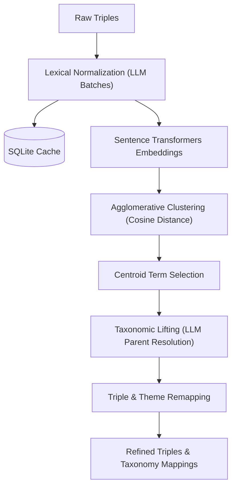
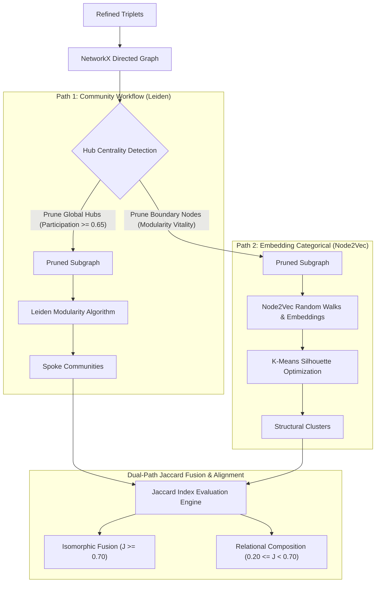
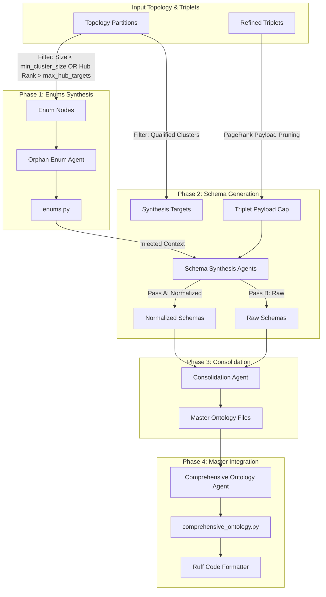

# SemanticPrism

SemanticPrism is an advanced, autonomous agentic pipeline designed to process unstructured, highly complex domain knowledge (such as clinical diagnostic texts) and mathematically synthesize it into structured, deployable Python Ontologies (Pydantic models).

Rather than relying on single-shot LLM schema generation—which often leads to hallucinations and overlapping domain definitions—SemanticPrism converts source text into mathematical graph networks, clusters those networks using graph theory and representation learning, and uses those structural boundaries to generate decoupled, high-fidelity data models.

---

## Overall Pipeline Execution Flow

The full end-to-end pipeline is executed via the master orchestrator script [run_pipeline.py](run_pipeline.py):

```bash
python3 run_pipeline.py
```

Each stage runs in an isolated subprocess to ensure system memory and GPU VRAM are cleanly garbage collected between intensive LLM and mathematical operations.

### Sub-Stage Execution Runners

Individual stage runner scripts are available for isolated execution or debugging:

- **Stage 1 (Extraction)**: `python3 run_stage_1.py`
  - Theme Discovery & Synthesis: `python3 run_stage_1_themes.py`
  - Triple Extraction & Aggregation: `python3 run_stage_1_triples.py`
- **Stage 2 (Refinement)**: `python3 run_stage_2.py`
  - Lexical Normalization: `python3 run_stage_2_normalization.py`
  - Taxonomic Lifting & Theme Mapping: `python3 run_stage_2_taxonomic_lifting.py`
- **Stage 3 (Topology)**: `python3 run_stage_3.py`
- **Stage 4 (Synthesis)**: `python3 run_stage_4.py`

---

## Pipeline Architecture & Stage Breakdowns

### Stage 1: Extraction ([run_stage_1.py](run_stage_1.py))

**Purpose:** Ingest source texts, discover domain themes, and extract raw Subject-Predicate-Object (S-P-O) semantic triplets.

* **Multi-Format Ingestion:** Loads raw text files (`.txt`/`.md`) or reads directly from Parquet datasets using Polars.
* **Global Theme Discovery & Synthesis:** Scans documents in sliding text chunks to identify localized themes, then synthesizes them into a unified master domain mapping. Anchoring subsequent triple extraction to these master themes prevents LLM hallucination drift over large documents.
* **Triplet Extraction & Recovery:** Uses Pydantic-AI agents to extract S-P-O triplets anchored to master themes, backed by an automated recovery agent to fix malformed response payloads.

---

### Stage 2: Refinement ([run_stage_2.py](run_stage_2.py))

**Purpose:** Clean, deduplicate, and normalize raw triplets into a standardized taxonomy.



* **Lexical Normalization:** Cleans syntax, standardizes spelling, expands acronyms, and normalizes phrasing using batch LLM calls backed by a persistent SQLite cache to avoid redundant API calls.
* **Sentence Embeddings & Vector Clustering:** Converts normalized terms into vector representations using `SentenceTransformers` (`all-MiniLM-L6-v2`) and groups similar concepts via `AgglomerativeClustering`.
* **Taxonomic Lifting:** Resolves synonym clusters into formal hypernym parent concepts using LLM agents (e.g., mapping *"WISC-5"*, *"wisc-v"*, and *"cognitive test"* to *"WISC psychometric assessment"*).
* **Triple & Theme Remapping:** Remaps raw triplets to their elevated hypernyms and maps lower-level themes to master themes using cosine vector similarity.

---

### Stage 3: Dual-Path Graph Topology & Fusion ([run_stage_3.py](run_stage_3.py))

**Purpose:** Map refined triplets into a directed network graph, partition the graph down dual topological paths, and unify the paths using Jaccard graph distance.



* **Dual-Path Partitioning:**
  1. **Path 1 (Community Workflow Path):** Prunes cross-domain connector hubs (via Participation Coefficient $P_i$ and betweenness centrality) to isolate tight event sequences using the **Leiden Modularity Algorithm**.
  2. **Path 2 (Embedding Categorical Path):** Prunes boundary-blurring nodes via Modularity Vitality ($\Delta Q$), generates **Node2Vec** random walk embeddings, and clusters them using **K-Means Silhouette Optimization**.
* **Dual-Path Jaccard Fusion:** Evaluates pairwise overlap $J(W_i, K_j) = \frac{|W_i \cap K_j|}{|W_i \cup K_j|}$. Fuses overlapping clusters into unified targets when $J \ge 0.70$ and establishes sub-class composition links when $0.20 \le J < 0.70$.
* **Interactive Visualizations:** Renders interactive PyVis HTML dashboards (topology graphs, ego networks, modularity plots, and Jaccard alignment heatmaps) under `outputs/visuals/`.

---

### Stage 4: Synthesis Engine ([run_stage_4.py](run_stage_4.py))

**Purpose:** Translate mathematical graph partitions into deployable Pydantic ontologies using path-isolated, multi-pass LLM synthesis.



* **Target Resolution & Payload Pruning:** Filters graph nodes into orphan enum pools vs primary schema targets based on cluster size, PageRank scoring, and hub centrality caps (`max_hub_targets`, `max_triplets_per_target`).
* **Multi-Pass Schema Synthesis:** Passes capped triplet payloads to synthesis agents to generate Pydantic schemas. Schemas enforce relational database compatibility (no arbitrary UUID keys, strict Enum/Literal types, optional attributes, and JSONB dictionary collapsing).
* **Consolidation & Code Formatting:** Combines multi-pass outputs into a single comprehensive ontology (`comprehensive_ontology.py`), formatted automatically using Ruff.

---

## Configuration (`configs/`)

Pipeline behavior is configured via modular YAML files in the `configs/` directory:

- **[configs/llm.yaml](configs/llm.yaml)**: Provider endpoints, LLM model names, temperature, VRAM management (`manage_vram`), context window limits, and async concurrency caps.
- **[configs/io.yaml](configs/io.yaml)**: Input/output paths, ingestion settings (directory vs. Parquet), and execution modes (`resume_mode`, `use_async`).
- **[configs/refinement.yaml](configs/refinement.yaml)**: Normalization batching, timeout thresholds, embedding models (`all-MiniLM-L6-v2`), and clustering distance cutoffs.
- **[configs/topology.yaml](configs/topology.yaml)**: Dual-path execution modes, Jaccard fusion thresholds, Leiden resolution, Node2Vec parameters, and visualization limits.
- **[configs/synthesis.yaml](configs/synthesis.yaml)**: Minimum cluster size for schema targets, max hub schema targets, and per-target triplet payload caps.
