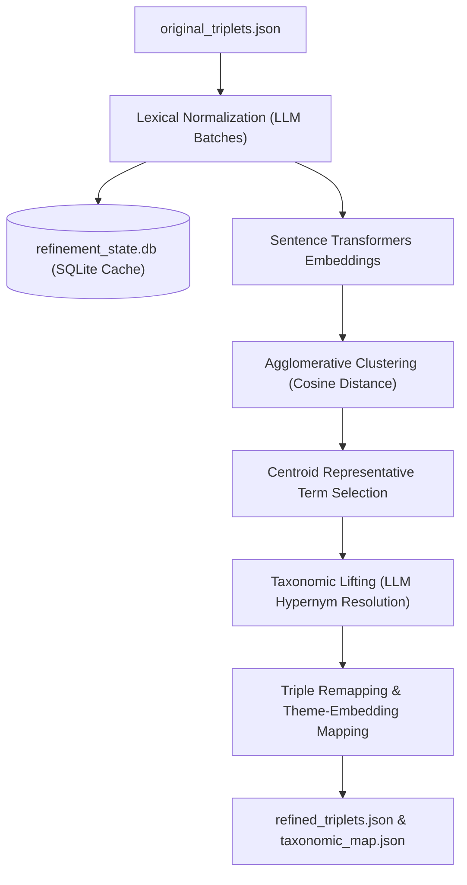
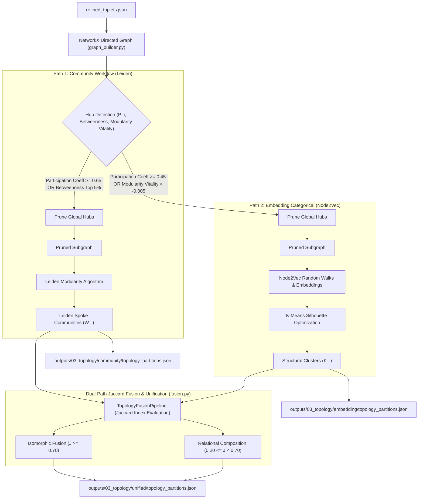
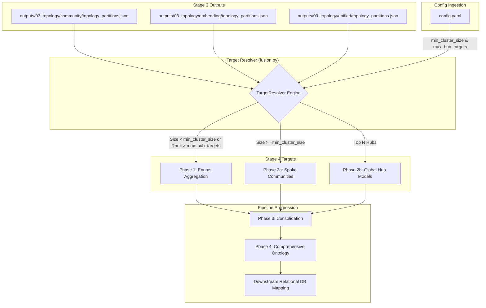
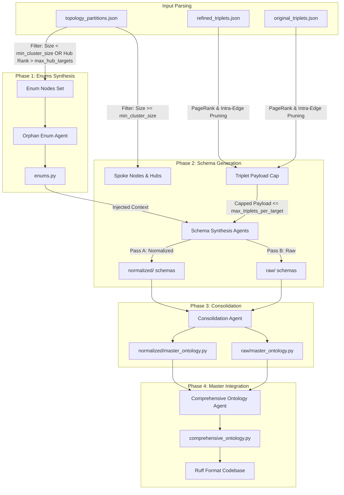

# SemanticPrism

SemanticPrism is an advanced, autonomous agentic pipeline designed to process unstructured, highly complex domain knowledge (such as clinical diagnostic texts) and mathematically synthesize it into structured, deployable Python Ontologies (Pydantic models).

The purpose of SemanticPrism is to solve the "hallucination and overlap" problem inherent in standard Large Language Model (LLM) schema generation. Rather than asking an LLM to guess the structure of a document in one shot, SemanticPrism breaks the text down into mathematical graph networks, clusters those networks using advanced graph theory and representation learning algorithms, and uses those mathematical boundaries to generate perfectly decoupled, high-fidelity data models.

---

## Overall Pipeline Execution Flow

The entire pipeline is orchestratable via the master script [run_pipeline.py](run_pipeline.py).
To run all stages in sequence, execute:
```bash
python3 run_pipeline.py
```
This execution uses separate subprocesses for each stage to ensure that GPU VRAM and system memory are cleanly garbage collected between intensive LLM and mathematical clustering processes.

Individual stage runner scripts are also provided for isolated or debugging execution:
- Stage 1: `python3 run_stage_1.py`
- Stage 2: `python3 run_stage_2.py` (or separately: `python3 run_stage_2_part_1.py` and `python3 run_stage_2_part_2.py`)
- Stage 3: `python3 run_stage_3.py`
- Stage 4: `python3 run_stage_4.py`

---

## Detailed Pipeline Architecture & Stage Breakdowns

The pipeline runs sequentially across four stages, utilizing outputs from preceding runs.

### Stage 1: Extraction ([run_stage_1.py](run_stage_1.py))
**Purpose:** To ingest unstructured source texts and extract raw semantic relationships and global themes.

*   **Multi-Format Document Ingestion:** Supports loading raw text files (`.txt` or `.md`) from a designated directory or loading directly from a single `.parquet` file (configured via `ingestion.source_type` in `config.yaml` using Polars).
*   **Global Theme Discovery (Phase 1 & 1.5):** The pipeline scans input documents in sliding text chunks to identify localized themes, saving individual document theme files (`<doc_id>_themes.json`) under `outputs/01_extraction/themes/`, which are aggregated into `all_themes.json`.
*   **Master Theme Synthesis (Phase 2):** Synthesizes the aggregated discovered themes into a unified master domain mapping (`master_themes.json`).
    *   *Underlying Detail (Context Anchoring):* The extracted themes provide semantic boundaries for the LLM during triple extraction. By anchoring the LLM to predefined themes, it prevents "hallucinated drift" when parsing massive, dense documents.
*   **Triplet Extraction & Reformat Recovery (Phase 3 & 3.5):** Employs Pydantic-AI agents to extract Subject-Predicate-Object (S-P-O) triplets anchored to master themes. Includes an automated recovery pass (`triple_reformat_agent`) to handle malformed JSON responses. Saves per-document triplets (`<doc_id>_triplets.json`) under `outputs/01_extraction/triples/`.
*   **Output Location (`outputs/01_extraction/`):**
    *   `themes/`: Individual document theme JSON files (`<doc_id>_themes.json`).
    *   `triples/`: Individual document triplet JSON files (`<doc_id>_triplets.json`).
    *   `all_themes.json`: Raw discovered themes across all documents.
    *   `master_themes.json`: Synthesized master domain and theme mappings.
    *   `original_triplets.json`: All raw extracted S-P-O triplets.
    *   `triplet_counts.csv`: CSV summary tracking extracted triplet volume per document.

---

### Stage 2: Refinement ([run_stage_2.py](run_stage_2.py))
**Purpose:** To clean, deduplicate, and normalize the raw, noisy triplets into a standardized, clean taxonomy. Can be executed as a unified script (`run_stage_2.py`) or in two modular sub-stages ([run_stage_2_part_1.py](run_stage_2_part_1.py) and [run_stage_2_part_2.py](run_stage_2_part_2.py)).



*   **Lexical Normalization (Part 1):** Cleans text syntax and uses batch LLM agents to correct spelling mistakes, expand acronyms, and normalize phrasing.
    *   *Underlying Detail (Preventing Graph Fragmentation):* Ensures that variations such as *"WISC-5"*, *"wisc-v"*, and *"wisc 5"* map to the exact same string to avoid disjoint nodes.
    *   *Persistent SQLite Caching:* Caches term normalization mappings in `outputs/02_refinement/refinement_state.db` (WAL-mode SQLite DB). Set `refinement.resume: true` to skip redundant API calls across execution runs.
*   **Sentence Embeddings & Vector Clustering (Part 2):** Converts normalized terms into vector representations using `SentenceTransformers` (`all-MiniLM-L6-v2`) and groups them using `AgglomerativeClustering` (cosine distance with cutoff `clustering_threshold`). Calculates frequency-weighted vector centroids for candidate term selection.
*   **Taxonomic Lifting:** Passes cluster terms to an LLM to resolve synonym clusters into formal hypernym parent concepts (e.g., mapping *"wisc-v"*, *"wisc 5"*, and *"cognitive test"* to *"WISC psychometric assessment"*).
*   **Triple & Theme Remapping:** Re-maps raw triplets to their taxonomic hypernyms (`refined_triplets.json`) and maps lower-level themes under master themes using cosine similarity (`theme_mapping_clusters.json`).
*   **Output Location (`outputs/02_refinement/`):**
    *   `refinement_state.db`: SQLite database caching term normalization state.
    *   `subject_normalization_map.json` / `predicate_normalization_map.json` / `object_normalization_map.json`: Field-specific lexical normalization maps.
    *   `normalization_map.json`: Consolidated lexical normalization lookup map.
    *   `subject_clusters.json` / `predicate_clusters.json` / `object_clusters.json`: Hierarchical cluster membership and centroid vector records.
    *   `subject_taxonomic_map.json` / `predicate_taxonomic_map.json` / `object_taxonomic_map.json` / `taxonomic_map.json`: Taxonomic lifting maps.
    *   `refined_triplets.json`: Cleaned, normalized, and remapped triplets.
    *   `theme_mapping_clusters.json`: Hierarchical mappings of themes.

---

### Stage 3: Dual-Path Graph Topology & Fusion ([run_stage_3.py](run_stage_3.py))
**Purpose:** To map refined triplets into a network graph, execute **Dual-Path Topological Partitioning** to discover workflow sequences and structural category taxonomies, and align/unify the two paths using **Jaccard Graph Distance Isomorphic Fusion**.



#### Detailed Stage 3 Process Flow & Updates
*   **Modular Architecture Split:**
    *   `src/topology/graph_builder.py`: Builds directed NetworkX graph, calculates centrality metrics ($P_i$, PageRank, Betweenness, Modularity Vitality), executes Path 1 (Leiden Modularity) and Path 2 (Node2Vec + K-Means), and exports primary path partitions and visual HTML charts.
    *   `src/topology/fusion.py` [NEW]: Encapsulates `TopologyFusionPipeline` (computes pairwise Jaccard similarity $J(W_i, K_j)$, classifies `isomorphic_fusion` vs `relational_composition`, and renders interactive unified dashboards) and `TargetResolver` (Stage 4 target qualification and triplet capping).
*   **Dual-Path Split:** The network graph is partitioned down two paths:
    1.  **Path 1 (Community Workflow Path):** Prunes cross-domain connector hubs (using Participation Coefficient $P_i \ge 0.65$ or top 5% shortest-path betweenness centrality) to isolate tight modular event-sequences. Partitioned via the **Leiden Modularity Algorithm**.
    2.  **Path 2 (Embedding Categorical Path):** Prunes nodes based on Modularity Vitality ($\Delta Q < -0.005$) and Participation Coefficient ($P_i \ge 0.45$). Generates **Node2Vec** random walk embeddings, clustered via **Silhouette K-Means Optimization**.
*   **Dual-Path Jaccard Fusion (`topology.fusion`):** Evaluates pairwise overlap $J(W_i, K_j) = \frac{|W_i \cap K_j|}{|W_i \cup K_j|}$. Fuses clusters into single targets when $J \ge 0.70$ (`fusion_threshold`) and creates relational sub-class composition links when $0.20 \le J < 0.70$ (`composition_threshold`).
*   **Theme Inheritance Overlap:** Computes node overlap ratios across themes (`inheritance_overlap_threshold`), persisting parent-child theme inheritance relationships inside `topology_partitions.json`.
*   **Output Locations:**
    *   `outputs/03_topology/normalized_triplets.json`: Normalized S-P-O statements used for graph construction.
    *   `outputs/03_topology/community/topology_partitions.json`: Path 1 community assignments, hubs, orphans, and centrality metrics.
    *   `outputs/03_topology/embedding/topology_partitions.json`: Path 2 structural cluster assignments, hubs, orphans, and centrality metrics.
    *   `outputs/03_topology/unified/topology_partitions.json`: Dual-Path Jaccard Fused cluster assignments, relational composition links, and alignment matrix.
*   **Interactive HTML Visualizations:** Exports interactive HTML dashboards under `outputs/visuals/community/`, `outputs/visuals/embedding/`, and `outputs/visuals/unified/` (including standard topology graphs, hubs & ego networks, global hubs, community/cluster networks, workflow narratives, participation dispersion maps, Stage 4 LLM payload gallery, collapsed module architecture diagrams, 2D Node2Vec PCA scatter plots, and unified Jaccard alignment heatmaps & bipartite alignment networks). Visual degree and node capping options (`min_node_degree`, `max_total_visual_nodes`) optimize canvas browser rendering performance.

---

### Transition: Stage 3 to Stage 4 Data Flow

This diagram maps how raw partitions and metrics exported by Stage 3 are dynamically resolved and routed by `TargetResolver` in [src/topology/fusion.py](src/topology/fusion.py):



---

### Stage 4: Synthesis Engine ([run_stage_4.py](run_stage_4.py))
**Purpose:** To translate mathematical graph partitions back into deployable Python Pydantic ontologies using path-isolated, multi-pass LLM synthesis.



#### Detailed Stage 4 Process Flow & Updates
*   **Relational Database-Driven Constraints:**
    System prompts produce schemas optimized for downstream relational SQL databases and extraction tools:
    1.  *No Unique Identifiers:* Arbitrary key fields (like `id` or `uuid`) are forbidden.
    2.  *Strict Enums/Literals:* Classifications use `enums.py` or standard `Literal` types.
    3.  *Default to Optional:* All attributes default to `Optional[Type] = None`.
    4.  *JSONB Table Collapsing:* Secondary attributes group into a metadata dictionary (e.g. `metadata: Optional[Dict[str, Any]] = None`) mapping to SQL `JSONB` columns.
*   **Hub Centrality-Based Pruning (`max_hub_targets`):**
    Ranks global hubs based on betweenness and degree centrality. Only the top $N$ hubs (`max_hub_targets`, defaulting to `4` in `config.yaml`) are generated as standalone schema tables; remaining hubs route to Phase 1 (`enums.py`).
*   **PageRank Triplet Payload Pruning (`max_triplets_per_target`):**
    Caps relation statements per schema target (`max_triplets_per_target`, defaulting to `1200` in `config.yaml`) based on node PageRank and intra-community edge status.
*   **Automated Schema Reformatter Agent:**
    Includes a 3rd-attempt fallback recovery agent (`schema_reformat_agent`) to automatically fix validation errors and malformed output code.
*   **Path-Isolated Output Location (`outputs/schemas/`):**
    Generates schemas inside path-isolated directories:
    *   `outputs/schemas/community/` (for Path 1) and/or `outputs/schemas/embedding/` (for Path 2)
    *   Subdirectories `normalized/` and `raw/` containing generated schemas (`01_community_0.py`, `enums.py`, `master_ontology.py`) formatted via Ruff.
    *   `comprehensive_ontology.py`: Unified master ontology combining raw and normalized passes.

---

## Centralized Error Logging & Diagnostics

Detailed error records and execution trace diagnostics are systematically persisted across pipeline runs inside `outputs/logs/`:
*   `outputs/logs/stage_01_theme_discovery_errors.json`: Stage 1 theme extraction errors.
*   `outputs/logs/stage_01_master_theme_errors.json`: Stage 1 master theme synthesis errors.
*   `outputs/logs/stage_01_triple_extraction_errors.json`: Stage 1 triple extraction errors and malformed payloads.
*   `outputs/logs/stage_02_refinement_errors.json`: Stage 2 normalization, timeout, and taxonomic lifting errors.
*   `outputs/logs/synthesis_community_errors.log` / `outputs/logs/synthesis_embedding_errors.log`: Stage 4 schema generation error traces and raw LLM retry dumps.

---

## Configuration Parameter Guide (`config.yaml`)

The entire execution of SemanticPrism is parameterized through [config.yaml](config.yaml):

| Config Section | Parameter | Type | Default | Description & Selection Guidance |
| :--- | :--- | :--- | :--- | :--- |
| **`pipeline`** | `use_async` | `boolean` | `true` | When enabled, API calls to the LLM (in Stages 2 and 4) are fired concurrently. |
| **`pipeline`** | `resume_mode` | `string` | `"overwrite"` | `"skip"` resumes from existing on-disk stage outputs; `"overwrite"` clears previous runs. |
| **`directories`**| `inputs` | `string` | `"inputs/testdocs"` | Directory path containing raw text source documents (`.txt` or `.md`). |
| **`directories`**| `outputs` | `string` | `"outputs"` | Base directory path where all stage outputs, logs, and schemas are saved. |
| **`ingestion`** | `source_type` | `string` | `"parquet"` | Ingestion source mode (`"directory"` for text files or `"parquet"` for parquet dataset). |
| **`ingestion`** | `parquet.filename` | `string` | `"inputs/testdocs.parquet"` | Parquet dataset file path when `source_type` is set to `"parquet"`. |
| **`ingestion`** | `parquet.id_field` | `string` | `"unique_val"` | Document identifier column name in Parquet dataset. |
| **`ingestion`** | `parquet.text_field` | `string` | `"report"` | Text payload column name in Parquet dataset. |
| **`llm`** | `provider` | `string` | `"ollama"` | Model provider host (e.g., `"ollama"`, `"google"`, `"openai"`). |
| **`llm`** | `model_name` | `string` | `"gemma4:26b"` | Global model identifier on provider host. |
| **`llm`** | `temperature` | `float` | `0.0` | Controls LLM creativity. Keep at `0.0` for maximum determinism. |
| **`llm`** | `manage_vram` | `boolean` | `true` | Purges system VRAM between stages to prevent Out-Of-Memory (OOM) GPU errors. |
| **`extraction`** | `domain` | `string` | `"General Subjects"`| Context domain setting given to Stage 1 extraction agents. |
| **`extraction`** | `context_window_cap`| `integer` | `8192` | Context window cap in tokens for Stage 1 theme and triple extraction. |
| **`refinement`** | `resume` | `boolean` | `true` | `true` resumes from cached SQLite DB (`refinement_state.db`); `false` starts fresh. |
| **`refinement`** | `max_async_calls` | `integer` | `6` | Maximum concurrent API calls during Stage 2 lexical normalization and lifting. |
| **`refinement`** | `batch_size` | `integer` | `25` | Number of terms per API payload batch during lexical normalization. |
| **`refinement`** | `timeout` | `float` | `300.0` | Timeout limit in seconds per normalization API batch. |
| **`refinement`** | `embedding_model` | `string` | `"all-MiniLM-L6-v2"` | SentenceTransformer embedding model identifier. |
| **`refinement`** | `clustering_threshold`| `float` | `0.6` | Agglomerative Clustering cosine distance cutoff for term deduplication. |
| **`refinement`** | `context_window_cap`| `integer` | `2048` | Context window cap in tokens for Stage 2 normalization and lifting. |
| **`topology`** | `execution_mode` | `string` | `"both"` | Stage 3 partition execution mode (`"community"`, `"embedding"`, or `"both"`). |
| **`topology`** | `fusion.enable_unification` | `boolean` | `true` | Enables Dual-Path Jaccard Isomorphic Fusion & Alignment step. |
| **`topology`** | `fusion.fusion_threshold` | `float` | `0.70` | Jaccard similarity cutoff ($J \ge 0.70$) for isomorphic cluster merging. |
| **`topology`** | `fusion.composition_threshold` | `float` | `0.20` | Jaccard cutoff ($0.20 \le J < 0.70$) for relational sub-class composition links. |
| **`topology`** | `inheritance_overlap_threshold`| `float` | `0.3` | Minimum node overlap ratio to record parent-child theme inheritance. |
| **`topology`** | `community_path.participation_threshold` | `float` | `0.65` | Participation cutoff ($P_i$) for Path 1 cross-community hubs. |
| **`topology`** | `community_path.betweenness_percentile` | `float` | `0.95` | Betweenness percentile cutoff for Path 1 narrative chokepoints. |
| **`topology`** | `community_path.leiden_resolution` | `float` | `1.0` | Leiden modularity resolution density parameter. |
| **`topology`** | `embedding_path.participation_threshold` | `float` | `0.45` | Participation cutoff ($P_i$) for Path 2 cross-category hubs. |
| **`topology`** | `embedding_path.enable_modularity_vitality_pruning` | `boolean` | `true` | Prunes boundary-blurring nodes ($\Delta Q < -0.005$) to isolate pure category clusters. |
| **`topology`** | `embedding_path.max_structural_clusters` | `integer` | `12` | Maximum K evaluated during K-Means Silhouette optimization search. |
| **`topology`** | `embedding_path.node2vec_dimensions` | `integer` | `128` | Vector space dimensionality for Node2Vec embeddings. |
| **`topology`** | `embedding_path.node2vec_walk_length` | `integer` | `10` | Length of random walk trajectories per node in Node2Vec. |
| **`topology`** | `embedding_path.node2vec_num_walks` | `integer` | `100` | Number of random walk iterations per node in Node2Vec. |
| **`topology`** | `visualizations.min_node_degree` | `integer` | `3` | Minimum node degree to render on global diagnostic HTML charts. |
| **`topology`** | `visualizations.max_nodes_per_cluster` | `integer` | `30` | Max central nodes per cluster to render on global diagnostic HTML charts. |
| **`topology`** | `visualizations.max_total_visual_nodes` | `float` | `0.25` | Max nodes fraction to render on global diagnostic HTML charts (0.25 = top 25%). |
| **`topology`** | `visualizations.freeze_physics` | `boolean` | `true` | Disable live physics engine after stabilization for smooth 60 FPS panning. |
| **`synthesis`** | `execution_mode` | `string` | `"community"` | Stage 4 topology ingestion mode (`"community"`, `"embedding"`, or `"both"`). |
| **`synthesis`** | `schema_pass_mode` | `string` | `"normalized"` | Stage 4 pass mode (`"normalized"`, `"raw"`, or `"both"`). |
| **`synthesis`** | `max_async_calls` | `integer` | `3` | Maximum concurrent API calls during Stage 4 schema generation. |
| **`synthesis`** | `min_cluster_size` | `integer` | `32` | Entity threshold for Stage 4 target qualification ($<32$ routed to `enums.py`). |
| **`synthesis`** | `max_hub_targets` | `integer` | `4` | Caps the number of global hub schema targets; remaining hubs are routed to `enums.py`. |
| **`synthesis`** | `max_triplets_per_target` | `integer` | `1200` | Caps the number of triplet statements sent to the LLM per schema target. |
| **`synthesis`** | `context_window_cap`| `integer` | `16384` | Context window cap in tokens for schema generation and consolidation. |
| **`synthesis`** | `llm.model_name` | `string` | `"SemP16k-Qwen122:latest"` | Stage 4 model override identifier. |
